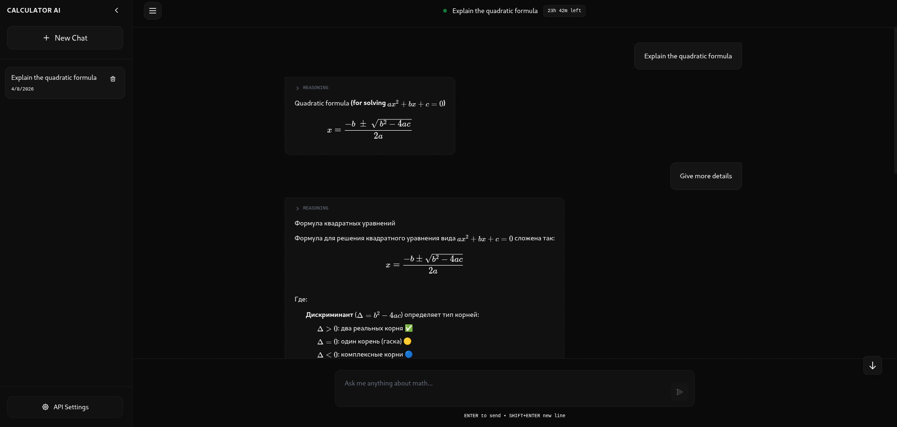
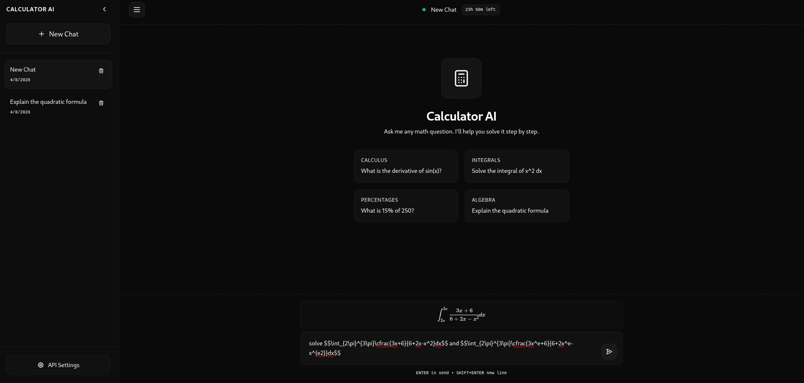

# Calculator AI
We provide chats and a few tools to help you write questions and understand agent answers. With strong prompts we give to users only short and understandable answers. Although you can always ask for more details.

## Screenshots




## Product context

Out end users are students. Out AI agent will help a lot with math. Sometimes students want a personal teacher or solutions for problems. Our product can show the solutions and describe it in more details.

## Features

We support a few tools to help students in writting formulas:
- preview formulas
- markdown support
- remember previous messages
- store data in database
- chat lifetime is 24h

Also we wanted to add some features in the future:
- Copy plain text from message
- AI agent selection
- Preview formulas in the input field
- Chat completion in the input field

## Usage
Out website is user-friendly. It is similar to Deepseek and ChatGPT websites. Hence, users with expirience in that platforms will find it easy to work with our website.

You can create chats with 24 hours lifetime and text to AI agent to answer your question. 

## Deployment

### Requirments

- OS: ubuntu 24.04
- Required packets: libpq-dev manapihttp
- Required db: postgresql

### Instruction

#### Using Docker
```bash
docker-compose up --build -d
```

#### Default Method

1. Setup and run ```postgresql``` with ```init-db.sql```
2. Build and compile ```frontend``` svelte project.
```bash
cd ./frontend
npm install
npm run build
```
3. Setup JSON config ```app.json``` in ```backend```
```json
{
  "api-key": "OPENROUTER API-KEY",
  "model": "OPENROUTER MODEL",
  "prompt": "PROMPT.",
  "db": {
    "host": "HOST",
    "port": "PORT",
    "user": "USER",
    "password": "PASS",
    "db": "DB"
  }
}
```
4. Build and compile ```backend```
```bash
cd ./backend
cmake -B build
cmake --build build
```
5. Run backend with environments
```bash
env CALCULATORAI_CONFIG=/path/to/app.json CALCULATORAI_FRONTEND=/path/to/frontend ./backend/build/backend
```
6. Check website on your host and port